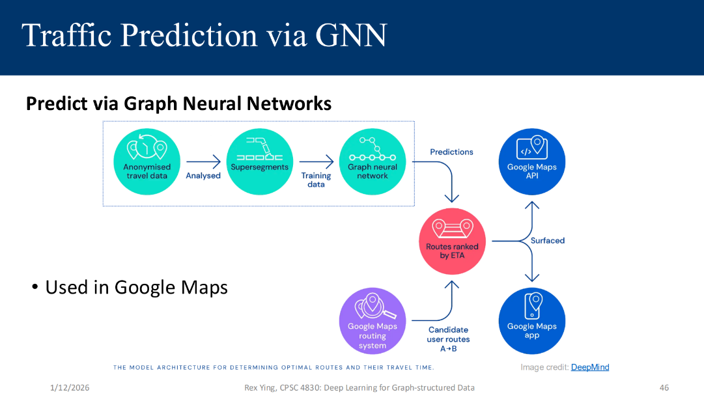
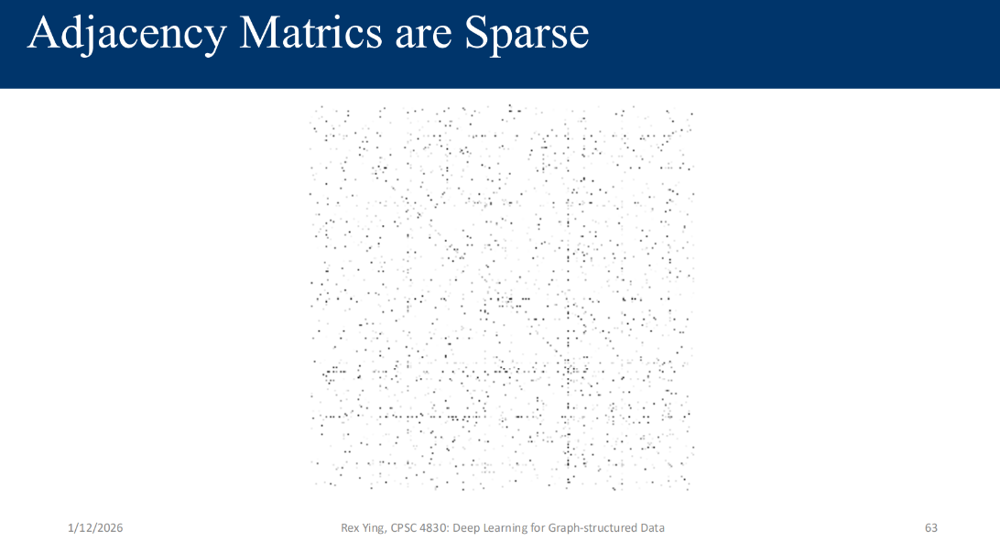

Graphs have applications through out humanity , ranging from sequential text which can be represented as a graph to complex networks , protein folds , etc...
ex: google maps

- simple recolllection of degree, bipartite graphs , folded bipartite graphs.

### Representing Graphs

- Adjacency matrix

directed and undirected , simple concepts

they are generally `sparse`

for an undirected graph , avg degree of a node `k` = `2|E|/|V|`

- Edge List 
- Adjacency List

• Connected (undirected) graph:
• Any two vertices can be joined by a path
• A disconnected graph is made up by two or more connected components

• Connected (directed) graph:
• Strongyly connected and weakly connected

Isomorphism:

say I have 2 graphs , if I can define a bijection f from V1 to V2 such that (a,b) belongs to E1 if f(a),f(b) belongs to E2.