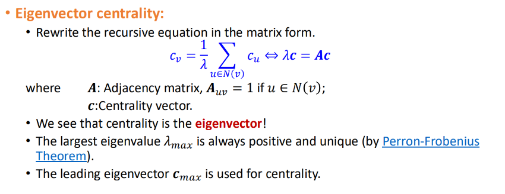
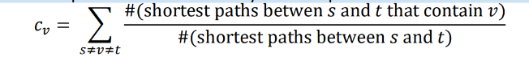
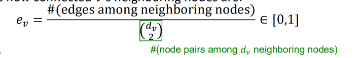
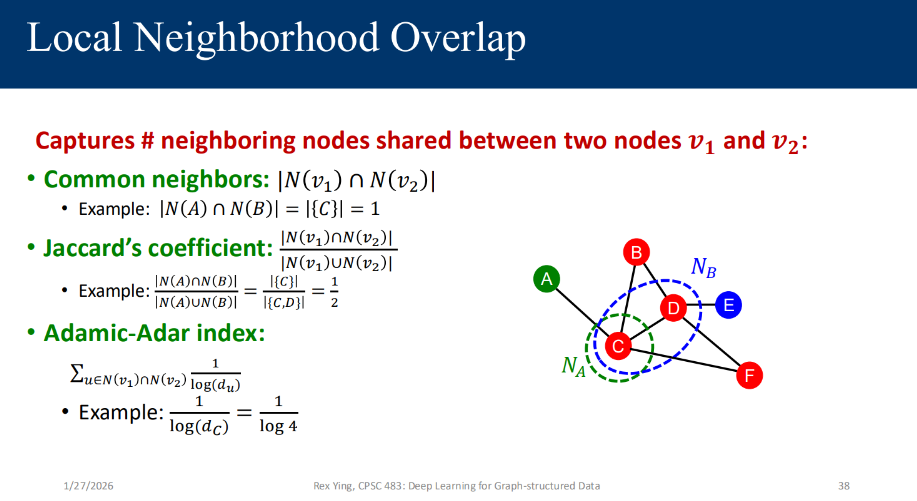
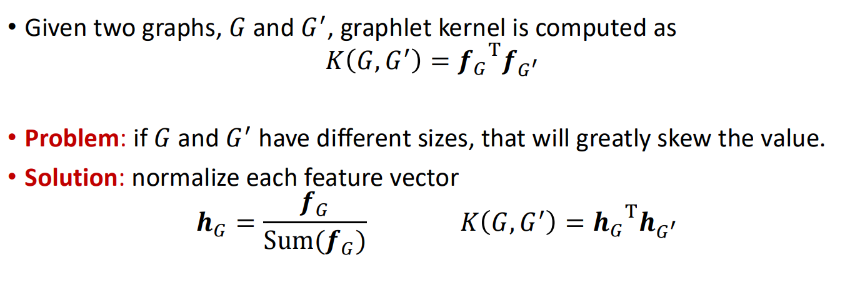

Objectives of Machine Learning for Graphs:

- Node Level Prediction
- Edge Level Prediction
- Graph level Prediction

In traditional graph ML , Machine Learning Tasks for Graph-structured Data:

• Node-level Tasks and Features
• Link / edge Prediction Tasks and Features
• Graph-Level Tasks, Features and Graph Kernels

Node Level:
    Undirected:
        (1) Citation Network, node : papers, edge is cited. Prediction: Research Fields
        (2) Molecules Conformation Generation : nodes: atoms , edges: chemical bonds , Prediction: 3D structure of a molecule
    Features:
        • Node degree
        • Node centrality : node importance in a graph via eiganvector centrality , closeneess centrality , etc.
        • Clustering coefficient
        • Graphlets 

eigan-vector centraility : 
we represent the graph as adjacency matrix and calculate the principal eigan vector.

closeness-centrality is pretty straight forward:
• A node is important if it has small shortest path lengths to all other nodes.
O(∣V∣(∣V∣+∣E∣)) considering BFS , 
for sparse graphs , O(∣V∣^2)
for dense graphs , O(∣V∣^3)

for weighted graphs , bfs is useless, we will have to run dijkstra 
O(∣V∣(∣V∣+∣E∣)log∣V∣)

Betweeness
• A node is important if it lies on many shortest paths between other nodes

using BFS,
For sparse graphs
O(∣V∣^3)
For dense graphs
O(∣V∣^4)

This is toomuch , so Brande's Algo:
for sparse graphs , O(∣V∣^2)
for dense graphs , O(∣V∣^3)

Clustering Coefficient 

Clustering coefficient counts the #(triangles) in the 
ego-network centered around a node 'v' .

Graphlets 
graphlet is simply a small connected induced subgraph.

Graphlet Degree Vector (GDV).
- count vector of graphlets rooted at a given 
node.

Link Prediction as a Task:

one of the use cases:
Knowledge Graph Completion
• Nodes: entities
• Edges: relations
• Predictions: missing relations

link based features
• Distance-based feature
• Local neighborhood overlap
• Global neighborhood overlap

Local Neighbourhood Overlap:

Global Neighbourhood overlap:
Katz index: count the number of paths of all lengths between a given pair of 
nodes.
K=A+βA2+β2A3+β3A4+⋯
A^r ij represents no of r-length walks between i and j.

Graph-Level Tasks, Features and Graph Kernels:
- Kernel methods are widely-used for traditional ML for graph-level prediction.
- a graph kernal answers 'how similar are these 2 graphs'? f(G1,G2)
-- graphlet kernel
-- weisfieler-lehman kernel
-- random walk kernel
-- shortest path kernel

graphlet kernel is computed as

BUT , Counting graphlets is expensive! 
• Counting size-k graphlets for a graph with size n by enumeration takes n^k
• This is unavoidable in the worst-case since subgraph isomorphism test 
(judging whether a graph is a subgraph of another graph) is NP-hard.

In weisfieler-lehman kernel , 
we use color refinement to get graph feature vector for G1,G2.
The inner product of the vectors is the kernel

Task: Graph Generation
generate graphs that fit some properties of the real graphs.
• Traditional methods: generate by randomness based on some assumptions
on the graph’s formulation process.
examples:
• Erdos-Renyi model -  each pair of nodes is connected with probability 'p'.
• Watts-Strogatz model (small world model) : 
    High clustering
    Very short average path lengths
• Barabási-Albert model : Nodes with many connections attract even more connections.
• Kronecker model : Expand the graph by kronecker product , start with an initiator matrix.

